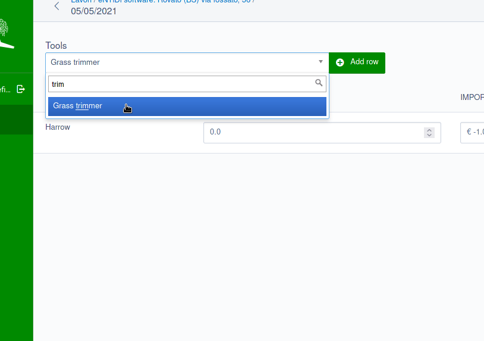

SilverStripe GridFieldAddFromList
=================================

This module provides a new `GridField` component that allows to add rows
to a grid only after setting a relation.

This is quite similar to what already done by stock
`GridFieldAddExistingAutocompleter` but with a few important
differences:

1. the relation is set by leveraging a standard `DropdownField`;
2. any relation can be handled (check `setTargetField()`);
3. the same item can be added more than once (check `setUnique()`).

This can be useful in contexts where `GridFieldAddExistingAutocompleter`
cannot be used, e.g. setting an **has-one** relation or linking the same
item more than once in **many-many** relations.

Installation
------------

    composer require entidi/silverstripe-gridfieldaddfromlist ^1.0

Other documentation
-------------------

* [Usage](docs/en/usage.md)
* [Contributing](CONTRIBUTING.md)
* [Code of Conduct](https://docs.silverstripe.org/en/contributing/code_of_conduct)
* [BSD license](LICENSE.md)
* [Support](docs/en/support.md)
